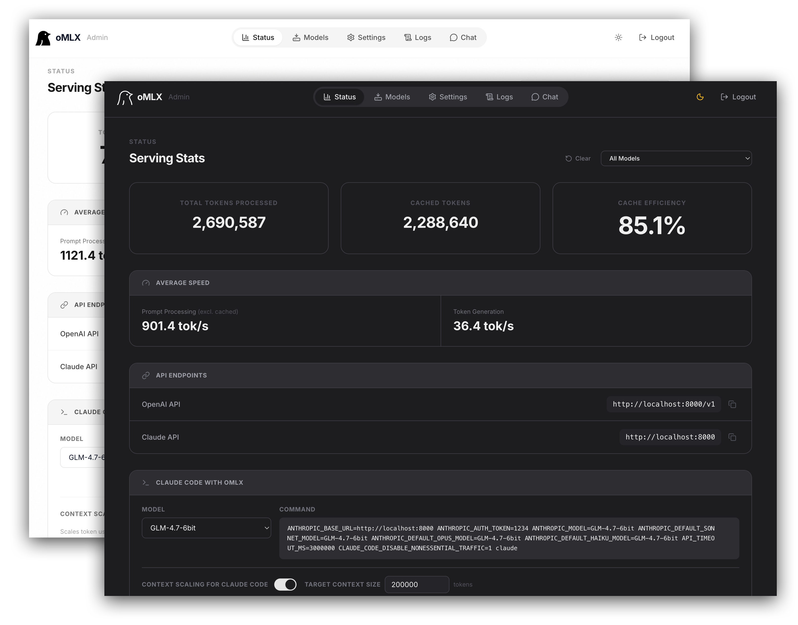
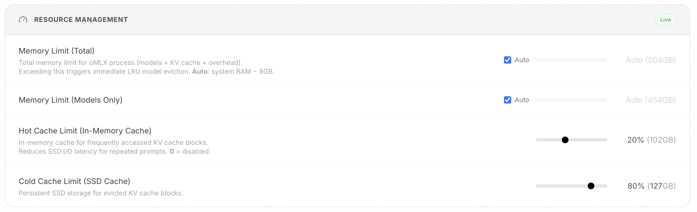
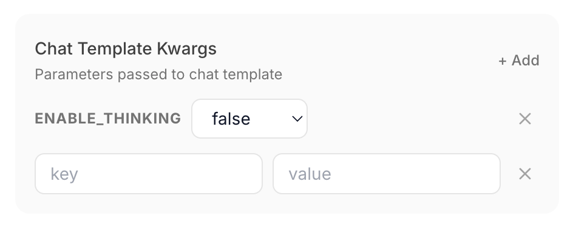
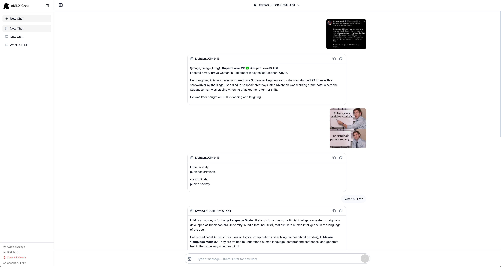
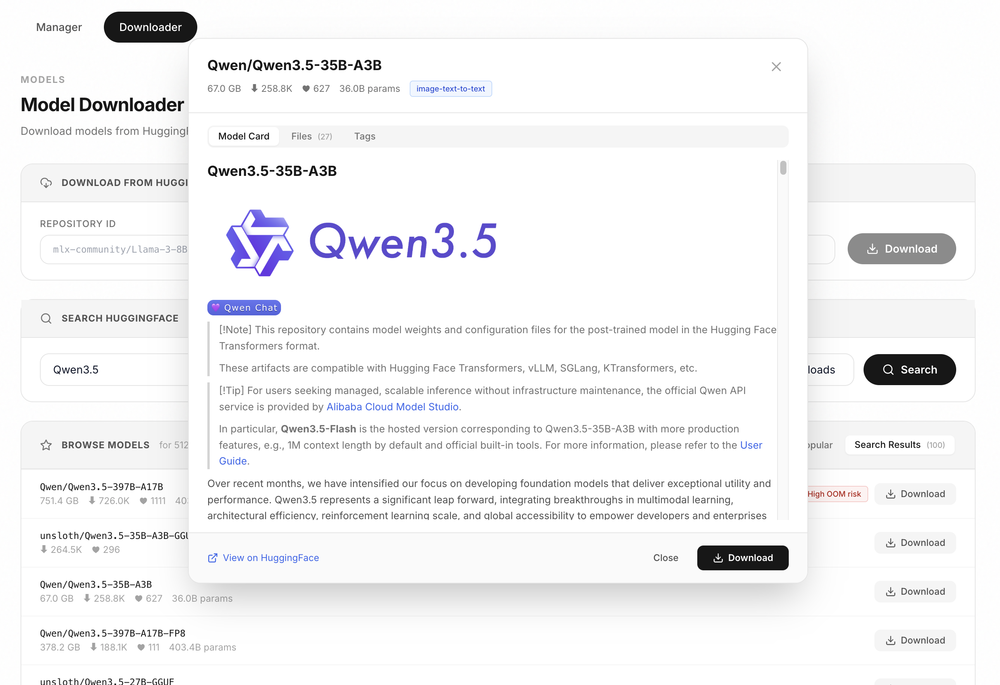
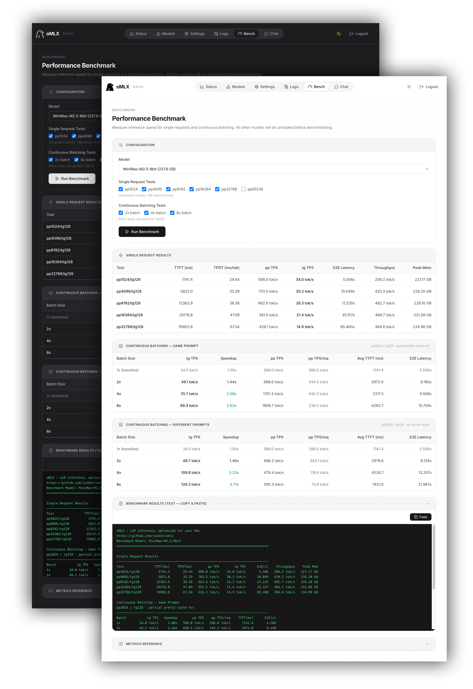

<p align="center">
  <picture>
    <source media="(prefers-color-scheme: dark)" srcset="docs/images/icon-rounded-dark.svg" width="140">
    <source media="(prefers-color-scheme: light)" srcset="docs/images/icon-rounded-light.svg" width="140">
    
  </picture>
</p>

<h1 align="center">oMLX</h1>
<p align="center"><b>Mac에 최적화된 LLM 추론 서버</b><br>Continuous Batching과 다단계 KV 캐시로 최적화된 추론 서버를, 메뉴바에서 편리하게</p>

<p align="center">
  
  
  
  <a href="https://buymeacoffee.com/jundot"></a>
</p>

<p align="center">
  <a href="mailto:junkim.dot@gmail.com">junkim.dot@gmail.com</a> · <a href="https://omlx.ai/me">https://omlx.ai/me</a>
</p>

<p align="center">
  <a href="#설치">설치</a> ·
  <a href="#빠른-시작">빠른 시작</a> ·
  <a href="#기능">기능</a> ·
  <a href="#모델">모델</a> ·
  <a href="#cli-설정">CLI 설정</a> ·
  <a href="https://omlx.ai/benchmarks">벤치마크</a> ·
  <a href="https://omlx.ai">oMLX.ai</a>
</p>

<p align="center">
  <a href="README.md">English</a> ·
  <a href="README.zh.md">中文</a> ·
  <b>한국어</b> ·
  <a href="README.ja.md">日本語</a>
</p>

---

<p align="center">
  
</p>

> *맥에서 LLM서버 많이 써보셨나요? 다들 많은 불편함을 겪으셨을 겁니다. 어떤 서버는 터미널에서 온갖 명령어를 입력해야 해서 불편하고, 어떤 서버는 GUI인데 이게 편리한가? 싶을만큼 너무 복잡하죠. 저는 그냥 자주 쓰는 모델을 고정 로딩하고, 무거운 모델은 필요할 때 자동으로 교체하고, 컨텍스트 제한을 설정하고, 모든 걸 그냥 쉽고 빠르게 사용하고 싶었습니다.*
>
> *oMLX는 Hot Cache-메모리와 Cold Cache-SSD의 두 계층에 걸쳐 KV캐시를 유지합니다. 대화 중간에 컨텍스트가 바뀌어도 모든 과거 컨텍스트가 캐시에 남습니다. Claude Code 같은 도구로 실제 코딩 작업을 해보셨나요? oMLX와 함께라면 가능합니다.*

## 설치

### macOS 앱

[Releases](https://github.com/jundot/omlx/releases)에서 `.dmg`를 다운로드하고, Applications에 드래그하면 끝입니다. 앱 내 자동 업데이트를 지원하므로 이후 업그레이드는 클릭 한 번이면 됩니다. macOS 앱은 `omlx` CLI 명령어를 포함하지 않습니다. 터미널 사용이 필요하면 Homebrew 또는 소스에서 설치하세요.

### Homebrew

```bash
brew tap jundot/omlx https://github.com/jundot/omlx
brew install omlx

# 최신 버전으로 업그레이드
brew update && brew upgrade omlx

# 백그라운드 서비스로 실행 (크래시 시 자동 재시작)
brew services start omlx

# 선택사항: MCP (Model Context Protocol) 지원
/opt/homebrew/opt/omlx/libexec/bin/pip install mcp
```

### 소스에서 설치

```bash
git clone https://github.com/jundot/omlx.git
cd omlx
pip install -e .          # 코어만
pip install -e ".[mcp]"   # MCP (Model Context Protocol) 포함
```

Python 3.10+와 Apple Silicon (M1/M2/M3/M4)이 필요합니다.

## 빠른 시작

### macOS 앱

Applications 폴더에서 oMLX를 실행하세요. 환영 화면에서 세 단계만 따라하면 됩니다 — 모델 디렉토리 설정, 서버 시작, 첫 모델 다운로드. 끝입니다.

<p align="center">
  
  
</p>

### CLI

```bash
omlx serve --model-dir ~/models
```

서버가 하위 디렉토리에서 LLM, VLM, 임베딩 모델, 리랭커를 자동으로 탐색합니다. OpenAI 호환 클라이언트에서 `http://localhost:8000/v1`로 연결할 수 있습니다. 내장 채팅 UI도 `http://localhost:8000/admin/chat`에서 사용 가능합니다.

### Homebrew 서비스

Homebrew로 설치한 경우 oMLX를 관리형 백그라운드 서비스로 실행할 수 있습니다:

```bash
brew services start omlx    # 시작 (크래시 시 자동 재시작)
brew services stop omlx     # 중지
brew services restart omlx  # 재시작
brew services info omlx     # 상태 확인
```

서비스는 기본 설정으로 `omlx serve`를 실행합니다 (`~/.omlx/models`, 포트 8000). 커스터마이즈하려면 환경 변수(`OMLX_MODEL_DIR`, `OMLX_PORT` 등)를 설정하거나, `omlx serve --model-dir /your/path`를 한 번 실행하여 `~/.omlx/settings.json`에 설정을 저장하세요.

로그는 두 곳에 기록됩니다:
- **서비스 로그**: `$(brew --prefix)/var/log/omlx.log` (stdout/stderr)
- **서버 로그**: `~/.omlx/logs/server.log` (구조화된 애플리케이션 로그)

## 기능

Apple Silicon에서 텍스트 LLM, 비전-언어 모델(VLM), OCR 모델, 임베딩 모델, 리랭커를 지원합니다.

### 관리자 대시보드

`/admin`에서 실시간 모니터링, 모델 관리, 채팅, 벤치마크, 모델별 설정을 위한 웹 UI를 제공합니다. 한국어, 영어, 일본어, 중국어를 지원합니다. 모든 CDN 의존성이 번들되어 완전한 오프라인 운영이 가능합니다.

<p align="center">
  
</p>

### 비전-언어 모델

텍스트 LLM과 동일한 연속 배칭 및 계층형 KV 캐시 스택으로 VLM을 실행합니다. 멀티 이미지 채팅, base64/URL/파일 이미지 입력, 비전 컨텍스트를 활용한 Tool calling을 지원합니다. OCR 모델(DeepSeek-OCR, DOTS-OCR, GLM-OCR)은 자동 감지되며 최적화된 프롬프트가 적용됩니다.

### 계층형 KV 캐시 (Hot + Cold)

vLLM에서 영감을 받은 블록 기반 KV 캐시 관리로, 프리픽스 공유와 Copy-on-Write를 지원합니다. 캐시는 두 계층으로 나뉩니다:

- **Hot 캐시 (RAM)**: 자주 사용하는 블록을 메모리에 유지합니다.
- **Cold 캐시 (SSD)**: Hot 캐시가 가득 차면 블록이 safetensors 형식으로 SSD에 저장됩니다. 다음 요청에서 같은 프리픽스가 있으면 처음부터 다시 계산할 필요 없이 디스크에서 바로 복원됩니다 — 서버를 재시작해도 유지됩니다.

<p align="center">
  
</p>

### 연속 배칭

mlx-lm의 BatchGenerator를 통해 동시 요청을 처리합니다. 최대 동시 요청 수는 CLI 또는 관리자 패널에서 설정할 수 있습니다.

### Claude Code 최적화

Claude Code에서 작은 컨텍스트 모델을 실행하기 위한 컨텍스트 스케일링을 지원합니다. Claude code에 리포팅되는 토큰 수를 스케일링하여 자동 Compact가 적절한 타이밍에 트리거되고, 긴 프리필 동안 읽기 타임아웃을 방지하는 SSE keep-alive를 제공합니다.

### 멀티 모델 서빙

동일한 서버에서 LLM, VLM, 임베딩 모델, 리랭커를 로드합니다. 자동 및 수동 제어를 조합하여 모델을 관리합니다:

- **LRU 언로드**: 메모리가 부족하면 가장 오래 사용하지 않은 모델이 자동으로 언로드됩니다.
- **수동 로드/언로드**: 관리자 패널의 상태 표시를 클릭해서 모델을 바로 로드하거나 언로드할 수 있습니다.
- **모델 고정**: 자주 사용하는 모델을 고정하여 항상 로드된 상태를 유지합니다.
- **모델별 TTL**: 모델별 유휴 타임아웃을 설정하여 일정 시간 비활성 후 자동 언로드합니다.
- **프로세스 메모리 제한**: 전체 메모리 제한 (기본값: 시스템 RAM - 8GB)으로 시스템 OOM을 방지합니다.

### 모델별 설정

관리자 패널에서 샘플링 파라미터, 채팅 템플릿 파라미터, TTL, 모델 별칭, 모델 타입 오버라이드 등을 모델별로 설정합니다. 서버 재시작 없이 즉시 적용됩니다.

- **모델 별칭**: 커스텀 API 표시 이름을 설정합니다. `/v1/models`에서 별칭을 반환하며, 요청 시 별칭과 디렉토리 이름 모두 사용 가능합니다.
- **모델 타입 오버라이드**: 자동 감지와 관계없이 LLM 또는 VLM으로 수동 설정합니다.

<p align="center">
  
</p>

### 내장 채팅

관리자 패널에서 로드된 모델과 직접 채팅할 수 있습니다. 대화 기록, 모델 전환, 다크 모드, 추론 모델 출력, 그리고 VLM/OCR 모델용 이미지 업로드 를 지원합니다.

<p align="center">
  
</p>


### 모델 다운로드

관리자 대시보드에서 HuggingFace의 MLX 모델을 직접 검색하고 다운로드합니다. 모델 카드 확인, 파일 크기 확인, 원클릭 다운로드가 가능합니다.

<p align="center">
  
</p>

### 성능 벤치마크

관리자 패널에서 원클릭 벤치마크를 실행합니다. 프리필(PP) 및 토큰 생성(TG) 초당 토큰 수를 측정하며, 실제 성능 수치를 위한 부분 프리픽스 캐시 히트 테스트도 포함합니다.

<p align="center">
  
</p>

### macOS 메뉴 바 앱

네이티브 PyObjC 메뉴 바 앱 (Electron이 아닙니다!). 터미널 없이 서버를 시작, 중지, 모니터링합니다. 서빙 통계 (재시작해도 유지됨), 크래시 시 자동 재시작, 앱 내 자동 업데이트를 포함합니다.

<p align="center">
  
</p>

### API 호환성

OpenAI 및 Anthropic API를 그대로 대체합니다. 스트리밍 사용량 통계 (`stream_options.include_usage`), Anthropic adaptive thinking, 비전 입력 (base64, URL)을 지원합니다.

| 엔드포인트 | 설명 |
|----------|------|
| `POST /v1/chat/completions` | 채팅 완성 (스트리밍) |
| `POST /v1/completions` | 텍스트 완성 (스트리밍) |
| `POST /v1/messages` | Anthropic Messages API |
| `POST /v1/embeddings` | 텍스트 임베딩 |
| `POST /v1/rerank` | 문서 리랭킹 |
| `GET /v1/models` | 사용 가능한 모델 목록 |

### Tool calling & 구조화된 출력

mlx-lm에서 사용 가능한 모든 함수 호출 형식, JSON 스키마 검증, MCP 도구 통합을 지원합니다. Tool calling은 모델의 채팅 템플릿이 `tools` 파라미터를 지원해야 합니다. 다음 모델 패밀리가 mlx-lm의 내장 도구 파서를 통해 자동 감지됩니다:

| 모델 패밀리 | 형식 |
|---|---|
| Llama, Qwen, DeepSeek 등 | JSON `<tool_call>` |
| Qwen3.5 시리즈 | XML `<function=...>` |
| Gemma | `<start_function_call>` |
| GLM (4.7, 5) | `<arg_key>/<arg_value>` XML |
| MiniMax | Namespaced `<minimax:tool_call>` |
| Mistral | `[TOOL_CALLS]` |
| Kimi K2 | `<\|tool_calls_section_begin\|>` |
| Longcat | `<longcat_tool_call>` |

위에 나열되지 않은 모델도 채팅 템플릿이 `tools`를 허용하고 출력이 인식 가능한 `<tool_call>` XML 형식을 사용하면 작동할 수 있습니다. Tool calling이 포함된 스트리밍 요청은 모든 콘텐츠를 버퍼링한 후 완료 시 결과를 전송합니다.

## 모델

`--model-dir`을 MLX 형식 모델 하위 디렉토리가 포함된 디렉토리로 지정합니다. 2단계 구조 폴더 (예: `mlx-community/model-name/`)도 지원됩니다.

```
~/models/
├── Step-3.5-Flash-8bit/
├── Qwen3-Coder-Next-8bit/
├── gpt-oss-120b-MXFP4-Q8/
├── Qwen3.5-122B-A10B-4bit/
└── bge-m3/
```

모델은 유형별로 자동 감지됩니다. 관리자 대시보드에서 직접 모델을 다운로드할 수도 있습니다.

| 유형 | 모델 |
|------|------|
| LLM | [mlx-lm](https://github.com/ml-explore/mlx-lm)이 지원하는 모든 모델 |
| VLM | Qwen3.5 시리즈, GLM-4V, Pixtral 및 기타 [mlx-vlm](https://github.com/Blaizzy/mlx-vlm) 모델 |
| OCR | DeepSeek-OCR, DOTS-OCR, GLM-OCR |
| 임베딩 | BERT, BGE-M3, ModernBERT |
| 리랭커 | ModernBERT, XLM-RoBERTa |

## CLI 설정

```bash
# 로드된 모델의 메모리 제한
omlx serve --model-dir ~/models --max-model-memory 32GB

# 프로세스 수준 메모리 제한 (기본값: auto = RAM - 8GB)
omlx serve --model-dir ~/models --max-process-memory 80%

# KV 블록용 SSD 캐시 활성화
omlx serve --model-dir ~/models --paged-ssd-cache-dir ~/.omlx/cache

# 메모리 내 Hot 캐시 크기 설정
omlx serve --model-dir ~/models --hot-cache-max-size 20%

# 최대 동시 요청 수 조정 (기본값: 8)
omlx serve --model-dir ~/models --max-concurrent-requests 16

# MCP 도구 사용
omlx serve --model-dir ~/models --mcp-config mcp.json

# API 키 인증
omlx serve --model-dir ~/models --api-key your-secret-key
# Localhost 전용: 관리자 패널 전체 설정에서 검증 건너뛰기
```

모든 설정은 `/admin`의 웹 관리자 패널에서도 설정할 수 있습니다. 설정은 `~/.omlx/settings.json`에 저장되며, CLI 플래그가 우선합니다.

<details>
<summary>아키텍처</summary>

```
FastAPI Server (OpenAI / Anthropic API)
    │
    ├── EnginePool (멀티 모델, LRU 언로드, TTL, 수동 로드/언로드)
    │   ├── BatchedEngine (LLM, 연속 배칭)
    │   ├── VLMEngine (비전-언어 모델)
    │   ├── EmbeddingEngine
    │   └── RerankerEngine
    │
    ├── ProcessMemoryEnforcer (전체 메모리 제한, TTL 체크)
    │
    ├── Scheduler (FCFS, 설정 가능한 동시 처리 수)
    │   └── mlx-lm BatchGenerator
    │
    └── Cache Stack
        ├── PagedCacheManager (GPU, 블록 기반, CoW, 프리픽스 공유)
        ├── Hot Cache (메모리 캐시, write-back)
        └── PagedSSDCacheManager (SSD Cold 캐시, safetensors 형식)
```

</details>

## 개발

### CLI 서버

```bash
git clone https://github.com/jundot/omlx.git
cd omlx
pip install -e ".[dev]"
pytest -m "not slow"
```

### macOS 앱

Python 3.11+와 [venvstacks](https://venvstacks.lmstudio.ai) (`pip install venvstacks`)가 필요합니다.

```bash
cd packaging

# 전체 빌드 (venvstacks + 앱 번들 + DMG)
python build.py

# venvstacks 건너뛰기 (코드 변경만)
python build.py --skip-venv

# DMG만
python build.py --dmg-only
```

앱 번들 구조 및 레이어 설정에 대한 자세한 내용은 [packaging/README.md](packaging/README.md)를 참조하세요.

## 기여하기

기여를 환영합니다! 자세한 내용은 [기여 가이드](docs/CONTRIBUTING.md)를 참조하세요.

- 버그 수정 및 개선
- 성능 최적화
- 문서 개선

## 라이선스

[Apache 2.0](LICENSE)

## 감사의 말

- [MLX](https://github.com/ml-explore/mlx)와 [mlx-lm](https://github.com/ml-explore/mlx-lm) by Apple
- [mlx-vlm](https://github.com/Blaizzy/mlx-vlm) - Apple Silicon에서의 비전-언어 모델 추론
- [vllm-mlx](https://github.com/waybarrios/vllm-mlx) - oMLX는 vllm-mlx v0.1.0에서 시작하여 멀티 모델 서빙, 계층형 KV 캐시, 페이지드 캐시를 완전 지원하는 VLM, 관리자 패널, macOS 메뉴 바 앱으로 크게 발전했습니다
- [venvstacks](https://venvstacks.lmstudio.ai) - macOS 앱 번들을 위한 포터블 Python 환경 레이어링
- [mlx-embeddings](https://github.com/Blaizzy/mlx-embeddings) - Apple Silicon을 위한 임베딩 모델 지원
