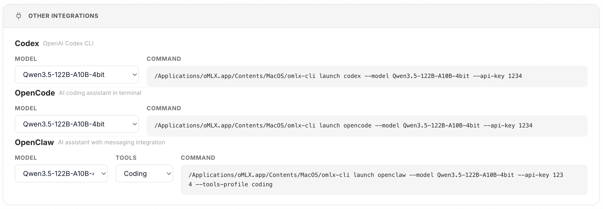

<p align="center">
  <picture>
    <source media="(prefers-color-scheme: dark)" srcset="docs/images/icon-rounded-dark.svg" width="140">
    <source media="(prefers-color-scheme: light)" srcset="docs/images/icon-rounded-light.svg" width="140">
    
  </picture>
</p>

<h1 align="center">oMLX</h1>
<p align="center"><b>LLM 推理，为你的 Mac 优化</b><br>连续批处理和分层 KV 缓存，直接从菜单栏管理。</p>

<p align="center">
  
  
  
  <a href="https://buymeacoffee.com/jundot"></a>
</p>

<p align="center">
  <a href="mailto:junkim.dot@gmail.com">junkim.dot@gmail.com</a> · <a href="https://omlx.ai/me">https://omlx.ai/me</a>
</p>

<p align="center">
  <a href="#安装">安装</a> ·
  <a href="#快速开始">快速开始</a> ·
  <a href="#功能">功能</a> ·
  <a href="#模型">模型</a> ·
  <a href="#cli-配置">CLI 配置</a> ·
  <a href="https://omlx.ai/benchmarks">基准测试</a> ·
  <a href="https://omlx.ai">oMLX.ai</a>
</p>

<p align="center">
  <a href="README.md">English</a> ·
  <b>中文</b> ·
  <a href="README.ko.md">한국어</a> ·
  <a href="README.ja.md">日本語</a>
</p>

---

<p align="center">
  
</p>

> *我试过的每个 LLM 服务器都让我在便利性和可控性之间做选择。我想把常用模型固定在内存中，按需自动切换较重的模型，设置上下文限制，并从菜单栏管理这一切。*
>
> *oMLX 将 KV 缓存持久化在热内存层和冷 SSD 层之间。即使对话中途上下文发生变化，所有历史上下文仍然保留在缓存中，可跨请求复用，让本地 LLM 在配合 Claude Code 等工具做实际编码时真正变得可用。这就是我做 oMLX 的原因。*

## 安装

### macOS 应用

从 [Releases](https://github.com/jundot/omlx/releases) 下载 `.dmg`，拖到 Applications 即可。应用支持自动更新，后续升级只需一键完成。macOS 应用不包含 `omlx` CLI 命令。如需在终端使用，请通过 Homebrew 或从源码安装。

### Homebrew

```bash
brew tap jundot/omlx https://github.com/jundot/omlx
brew install omlx

# 升级到最新版本
brew update && brew upgrade omlx

# 作为后台服务运行（崩溃时自动重启）
brew services start omlx

# 可选：MCP（Model Context Protocol）支持
/opt/homebrew/opt/omlx/libexec/bin/pip install mcp
```

### 从源码安装

```bash
git clone https://github.com/jundot/omlx.git
cd omlx
pip install -e .          # 仅核心
pip install -e ".[mcp]"   # 含 MCP（Model Context Protocol）支持
```

需要 macOS 15.0+ (Sequoia), Python 3.10+ 和 Apple Silicon（M1/M2/M3/M4）。

## 快速开始

### macOS 应用

从 Applications 文件夹启动 oMLX。欢迎界面会引导你完成三个步骤 — 模型目录设置、服务器启动、首个模型下载。就是这样。要连接 OpenClaw、OpenCode 或 Codex，请参阅[集成](#集成)。

<p align="center">
  
  
</p>

### CLI

```bash
omlx serve --model-dir ~/models
```

服务器会自动从子目录中发现 LLM、VLM、嵌入模型和重排序模型。任何 OpenAI 兼容客户端都可以连接到 `http://localhost:8000/v1`。内置聊天 UI 也可在 `http://localhost:8000/admin/chat` 使用。

### Homebrew 服务

如果通过 Homebrew 安装，可以将 oMLX 作为托管后台服务运行：

```bash
brew services start omlx    # 启动（崩溃时自动重启）
brew services stop omlx     # 停止
brew services restart omlx  # 重启
brew services info omlx     # 查看状态
```

服务使用默认配置运行 `omlx serve`（`~/.omlx/models`，端口 8000）。要自定义，可以设置环境变量（`OMLX_MODEL_DIR`、`OMLX_PORT` 等），或运行一次 `omlx serve --model-dir /your/path` 将设置保存到 `~/.omlx/settings.json`。

日志写入两个位置：
- **服务日志**: `$(brew --prefix)/var/log/omlx.log`（stdout/stderr）
- **服务器日志**: `~/.omlx/logs/server.log`（结构化应用日志）

## 功能

在 Apple Silicon 上支持文本 LLM、视觉语言模型（VLM）、OCR 模型、嵌入模型和重排序模型。

### 管理后台

在 `/admin` 提供实时监控、模型管理、聊天、基准测试和模型级设置的 Web UI。支持英语、韩语、日语和中文。所有 CDN 依赖已内置，完全支持离线运行。

<p align="center">
  
</p>

### 视觉语言模型

使用与文本 LLM 相同的连续批处理和分层 KV 缓存堆栈运行 VLM。支持多图聊天、base64/URL/文件图像输入，以及带视觉上下文的工具调用。OCR 模型（DeepSeek-OCR、DOTS-OCR、GLM-OCR）会被自动识别，并使用优化的提示词。

### 分层 KV 缓存（热缓存 + 冷缓存）

借鉴 vLLM 的基于块的 KV 缓存管理，支持前缀共享和写时复制（Copy-on-Write）。缓存分为两个层级：

- **热缓存（RAM）**: 频繁访问的块保留在内存中，实现快速读取。
- **冷缓存（SSD）**: 热缓存满时，块会以 safetensors 格式转存到 SSD。下次请求命中相同前缀时，直接从磁盘恢复，无需重新计算 — 即使服务器重启也不会丢失。

<p align="center">
  
</p>

### 连续批处理

通过 mlx-lm 的 BatchGenerator 处理并发请求。最大并发请求数可通过 CLI 或管理面板配置。

### Claude Code 优化

支持在 Claude Code 中使用较小上下文模型的上下文缩放。通过缩放上报的 Token 数量，让自动压缩在合适的时机触发，同时提供 SSE keep-alive 防止长时间预填充导致的读取超时。

### 多模型服务

在同一服务器中加载 LLM、VLM、嵌入模型和重排序模型。通过自动和手动控制的组合管理模型：

- **LRU 驱逐**: 内存不足时，最近最少使用的模型会被自动卸载。
- **手动加载/卸载**: 在管理后台通过状态标识按需加载或卸载模型。
- **模型固定**: 固定常用模型使其始终保持加载状态。
- **模型级 TTL**: 为每个模型设置空闲超时，在一段时间不活动后自动卸载。
- **进程内存限制**: 总内存限制（默认：系统 RAM - 8GB）防止系统级 OOM。

### 模型级设置

在管理后台直接配置每个模型的采样参数、聊天模板参数、TTL、模型别名、模型类型覆盖等。修改即时生效，无需重启服务器。

- **模型别名**: 设置自定义 API 显示名称。`/v1/models` 返回别名，请求时别名和目录名均可使用。
- **模型类型覆盖**: 无论自动检测结果如何，手动设置为 LLM 或 VLM。

<p align="center">
  
</p>

### 内置聊天

从管理后台直接与已加载的模型聊天。支持对话历史、模型切换、深色模式、推理模型输出，以及 VLM/OCR 模型的图片上传。

<p align="center">
  
</p>


### 模型下载器

在管理后台中直接搜索和下载 HuggingFace 上的 MLX 模型。浏览模型卡片、查看文件大小，一键下载。

<p align="center">
  
</p>

### 集成

在管理后台中一键设置 OpenClaw、OpenCode 和 Codex。无需手动编辑配置文件。

<p align="center">
  
</p>

### 性能基准测试

从管理后台一键运行基准测试。测量预填充（PP）和 Token 生成（TG）的每秒 Token 数，包含部分前缀缓存命中测试以获得真实的性能数据。

<p align="center">
  
</p>

### macOS 菜单栏应用

原生 PyObjC 菜单栏应用（非 Electron）。无需打开终端即可启动、停止和监控服务器。包含持久化服务统计（重启后保留）、崩溃自动重启和应用内自动更新。

<p align="center">
  
</p>

### API 兼容性

OpenAI 和 Anthropic API 的直接替代品。支持流式使用统计（`stream_options.include_usage`）、Anthropic adaptive thinking 和视觉输入（base64、URL）。

| 端点 | 说明 |
|----------|------|
| `POST /v1/chat/completions` | 聊天补全（流式） |
| `POST /v1/completions` | 文本补全（流式） |
| `POST /v1/messages` | Anthropic Messages API |
| `POST /v1/embeddings` | 文本嵌入 |
| `POST /v1/rerank` | 文档重排序 |
| `GET /v1/models` | 列出可用模型 |

### 工具调用与结构化输出

支持 mlx-lm 中所有可用的函数调用格式、JSON Schema 验证和 MCP 工具集成。工具调用需要模型的聊天模板支持 `tools` 参数。以下模型系列通过 mlx-lm 的内置工具解析器自动检测：

| 模型系列 | 格式 |
|---|---|
| Llama、Qwen、DeepSeek 等 | JSON `<tool_call>` |
| Qwen3.5 系列 | XML `<function=...>` |
| Gemma | `<start_function_call>` |
| GLM (4.7, 5) | `<arg_key>/<arg_value>` XML |
| MiniMax | Namespaced `<minimax:tool_call>` |
| Mistral | `[TOOL_CALLS]` |
| Kimi K2 | `<\|tool_calls_section_begin\|>` |
| Longcat | `<longcat_tool_call>` |

上表未列出的模型，只要聊天模板支持 `tools` 参数且输出采用可识别的 `<tool_call>` XML 格式，也有可能正常工作。针对支持工具调用的流式请求，系统会增量发射助手文本，同时隐藏已知的工具调用控制标记；结构化工具调用将在完成整个回合解析后发射。

## 模型

将 `--model-dir` 指向包含 MLX 格式模型子目录的目录。支持两级目录结构（如 `mlx-community/model-name/`）。

```
~/models/
├── Step-3.5-Flash-8bit/
├── Qwen3-Coder-Next-8bit/
├── gpt-oss-120b-MXFP4-Q8/
├── Qwen3.5-122B-A10B-4bit/
└── bge-m3/
```

模型会按类型自动识别。也可以直接在管理后台下载模型。

| 类型 | 模型 |
|------|------|
| LLM | [mlx-lm](https://github.com/ml-explore/mlx-lm) 支持的所有模型 |
| VLM | Qwen3.5 系列、GLM-4V、Pixtral 及其他 [mlx-vlm](https://github.com/Blaizzy/mlx-vlm) 模型 |
| OCR | DeepSeek-OCR、DOTS-OCR、GLM-OCR |
| 嵌入 | BERT、BGE-M3、ModernBERT |
| 重排序 | ModernBERT、XLM-RoBERTa |

## CLI 配置

```bash
# 已加载模型的内存限制
omlx serve --model-dir ~/models --max-model-memory 32GB

# 进程级内存限制（默认：auto = RAM - 8GB）
omlx serve --model-dir ~/models --max-process-memory 80%

# 启用 KV 块的 SSD 缓存
omlx serve --model-dir ~/models --paged-ssd-cache-dir ~/.omlx/cache

# 设置内存热缓存大小
omlx serve --model-dir ~/models --hot-cache-max-size 20%

# 调整最大并发请求数（默认: 8）
omlx serve --model-dir ~/models --max-concurrent-requests 16

# 使用 MCP 工具
omlx serve --model-dir ~/models --mcp-config mcp.json

# HuggingFace 镜像端点（适用于受限地区）
omlx serve --model-dir ~/models --hf-endpoint https://hf-mirror.com

# API 密钥认证
omlx serve --model-dir ~/models --api-key your-secret-key
# 仅限 Localhost：在管理后台全局设置中跳过验证
```

以上所有设置也可以在 `/admin` 的 Web 管理后台中配置。设置保存在 `~/.omlx/settings.json`，CLI 参数优先级更高。

<details>
<summary>架构</summary>

```
FastAPI Server (OpenAI / Anthropic API)
    │
    ├── EnginePool (多模型、LRU 驱逐、TTL、手动加载/卸载)
    │   ├── BatchedEngine (LLM，连续批处理)
    │   ├── VLMEngine (视觉语言模型)
    │   ├── EmbeddingEngine
    │   └── RerankerEngine
    │
    ├── ProcessMemoryEnforcer (总内存限制、TTL 检查)
    │
    ├── Scheduler (FCFS，可配置并发数)
    │   └── mlx-lm BatchGenerator
    │
    └── Cache Stack
        ├── PagedCacheManager (GPU，基于块，CoW，前缀共享)
        ├── Hot Cache (内存缓存，write-back)
        └── PagedSSDCacheManager (SSD 冷缓存，safetensors 格式)
```

</details>

## 开发

### CLI 服务器

```bash
git clone https://github.com/jundot/omlx.git
cd omlx
pip install -e ".[dev]"
pytest -m "not slow"
```

### macOS 应用

需要 Python 3.11+ 和 [venvstacks](https://venvstacks.lmstudio.ai)（`pip install venvstacks`）。

```bash
cd packaging

# 完整构建（venvstacks + 应用包 + DMG）
python build.py

# 跳过 venvstacks（仅代码更改）
python build.py --skip-venv

# 仅 DMG
python build.py --dmg-only
```

应用包结构和层配置的详细说明请参阅 [packaging/README.md](packaging/README.md)。

## 贡献

欢迎贡献！详情请参阅[贡献指南](docs/CONTRIBUTING.md)。

- Bug 修复和改进
- 性能优化
- 文档改进

## 许可证

[Apache 2.0](LICENSE)

## 致谢

- [MLX](https://github.com/ml-explore/mlx) 和 [mlx-lm](https://github.com/ml-explore/mlx-lm) by Apple
- [mlx-vlm](https://github.com/Blaizzy/mlx-vlm) - Apple Silicon 上的视觉语言模型推理
- [vllm-mlx](https://github.com/waybarrios/vllm-mlx) - oMLX 从 vllm-mlx v0.1.0 起步，经过大幅演进，增加了多模型服务、分层 KV 缓存、完整分页缓存支持的 VLM、管理后台和 macOS 菜单栏应用
- [venvstacks](https://venvstacks.lmstudio.ai) - macOS 应用包的便携 Python 环境分层
- [mlx-embeddings](https://github.com/Blaizzy/mlx-embeddings) - Apple Silicon 嵌入模型支持
